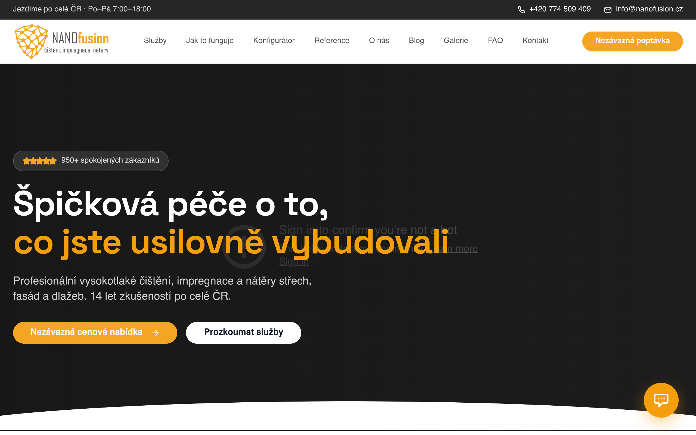
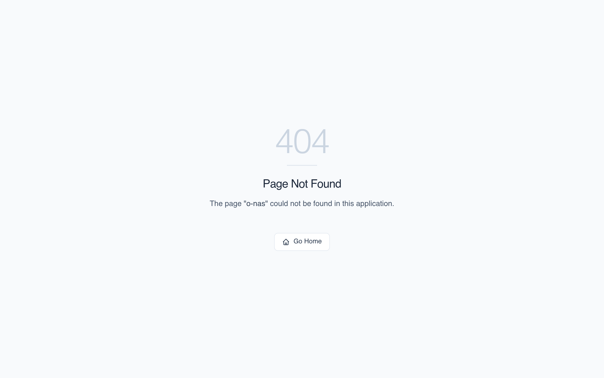
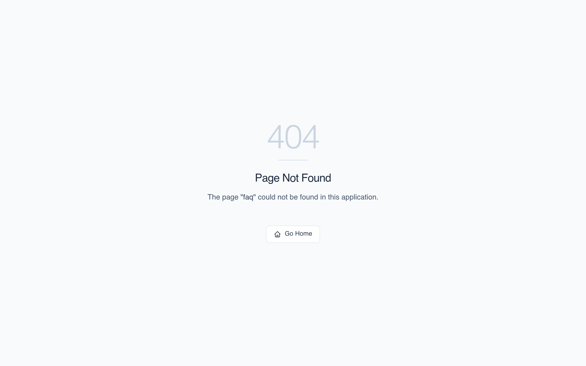

# NANOfusion — Visual References & Page Designs

This document provides visual references and screenshots of the NANOfusion pages for AI agents, design auditors, and frontend compilers. It serves as a visual guide to ensure style and layout consistency without executing JavaScript.

## 🎨 Brand Design Guidelines
* **Colors:** Warm premium amber highlights (`#f59e0b`), slate dark-mode blocks (`#0f172a`), deep white cards, and slate-50 backgrounds.
* **Typography:** `Outfit` font family with bold/extra-bold black headings and tight tracking (`-0.025em`).
* **Layout elements:** Glassmorphism headers (blurry background), rounded borders (`1.5rem` / `2rem`), subtle hover shadow transitions, and floating badge tags.

## 📸 Screenshots

### 🏠 Homepage Layout
* **URL:** [https://nanofusion.cz/](https://nanofusion.cz/)
* **Visual Representation:**
  

### ℹ️ About Us (O nás) Layout
* **URL:** [https://nanofusion.cz/o-nas](https://nanofusion.cz/o-nas)
* **Visual Representation:**
  

### ❓ FAQ Layout
* **URL:** [https://nanofusion.cz/faq](https://nanofusion.cz/faq)
* **Visual Representation:**
  
